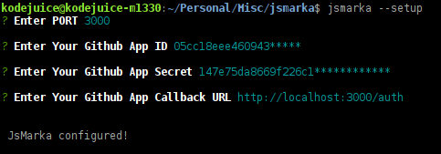

# JSMarka
[](https://www.npmjs.com/package/jsmarka)
[](https://travis-ci.org/kodejuice/jsmarka)

JSMarka is a Javascript Code Performance benchmarking app

[jsmarka.herokuapp.com](https://jsmarka.herokuapp.com)


## Running a local copy of JSMarka

### Requirements

1. [Node.js](https://nodejs.org/en/) v11

2. [MongoDB](https://docs.mongodb.com/manual/installation)


### Install using npm

```bash
$ npm install -g jsmarka
```

<br>
After installation, run the following to start JSMarka

```bash
$ jsmarka -p 3000
```
This gets jsmarka server running on port **3000**, visit [http://localhost:3000/](http://localhost:3000/) and start benchmarking.
Use `jsmarka --help` for more useful commands


### Setup (Optional)

If you would like to save tests locally, then you should Register a new OAuth GitHub application

[Register a new OAuth GitHub application](https://github.com/settings/applications/new), set the "Callback" url to `http://localhost:3000/auth`, then get the apps' "Client ID" and "Client Secret".

_**Note:** You should set the GitHub App "Callback" urls' port to whatever you've configured jsmarka to run on. (see below)_


### Set up jsmarka via CLI

Run:
```bash
$ jsmarka --setup
```



After the setup, a `.env` file containing your setup info is created, to view the contents of this file do:

```bash
$ jsmarka --list
```
You can see that the `PORT` value is the same port used in the `GitHub App Callback URL`, that's how yours should be set.

Run `jsmarka --help` to see useful commands.


## Development

If you're installing JSMarka for development purpopses then you have to clone this repo and install its dependencies:

```bash
$ git clone http://github.com/kodejuice/jsmarka.git
$ cd jsmarka
$ npm install
```

### Contributing to JSMarka

Submit a pull request to `master` with passing tests (`npm test`).

Run:

```bash
$ npm run dev
```

before writting code, as it automatically:
1. Restarts the server on every change
2. Re-builds the assets (if you make any changes inside [`client/`](https://github.com/kodejuice/jsmarka/tree/master/client))


Use `npm run build` to manually re-build the assets


### Testing

JSMarka uses [CasperJS](https://casperjs.org) which in turn requires [PhantomJS](http:///phantomjs.org) for end-to-end testing, So you should have both casperjs and phantomjs installed on your system.

First, have a separate terminal running `npm start`

Then run the test suites in another terminal/tab:

```bash
$ npm test
```

Screenshots are taken, find them in the `test/screenshots/` folder.
